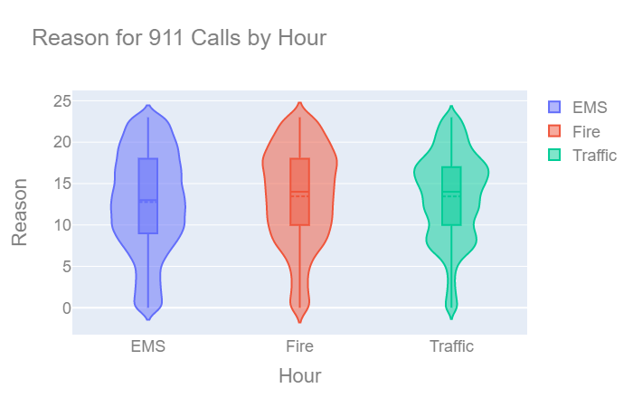

# 911-Calls-Capstone-Project
Utilized NumPy, Pandas, Seaborn, Plotly in Jupyter notebook to conduct EDA on about 100,000 911 calls in Montgomery, PA from 2015-2016. Here are some of the graphs that I used to help facilitate the analysis:

* Count plot
* Line plot
* Scatter plot 
* Linear regression plot
* Heat map
* Cluster heat map
* Interactive violin plot  

* Interactive choropleth map  

